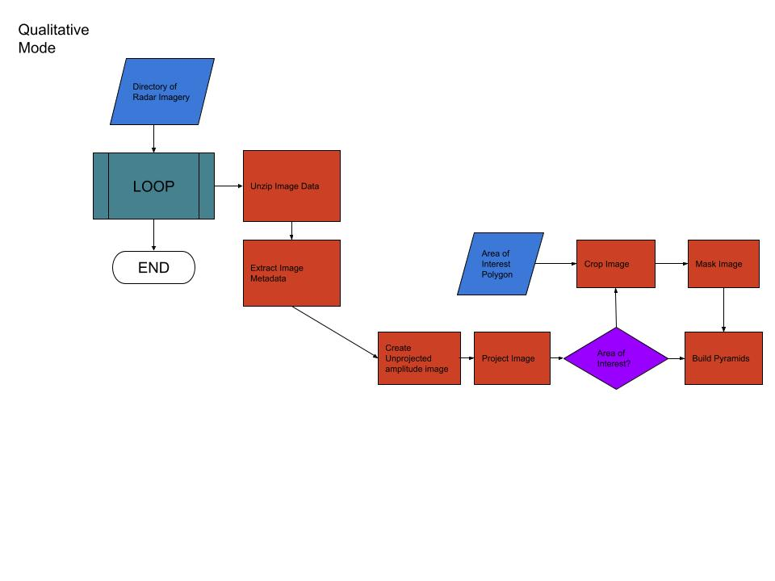

Overview of the Project
=======================

Introduction
------------

SigLib stands for Signature Library and is a suite of tools to query, manipulate and process remote sensing imagery (primarily Synthetic Aperture Radar (SAR) imagery) and store the data in a geodatabse.  It uses open source libraries and can be run on Windows, Mac, or Linux.  

There are 3 main ''modes'' that it can run in (or combinations of these)  

#. A data **Query Mode** where remote sensing scenes by querying various  SAR imagery sources including EODMS, Copernicus Open-Access Hub, and local harddrives. Queries take a Region Of Interest -- ***ROI shapefile*** with a specific format as input. The region of interest delineates the spatial and temporal search boundaries. The required attribute fields and formats for the ROI are elaborated upon in a section below. 

#. A **Qualitative Mode** where remote sensing scenes are made ready for viewing.  This includes opening zip files, converting imagery (including Single Look Complex), geographical projection, cropping, masking, image stretching, renaming, and pyramid generation. The user must supply the name of a single zip file that contains the SAR imagery, a directory where a batch of zip files to be prepared resides, or a csv/txt list of file paths.

#. A **Quantitative Mode** where a quantitative analysis of the radar signature or backscatter (also known as the normalized radar cross section (nrcs) or sigma nought) is performed. It can extract the sigma nought values within imagery that coincides with specific regions of interest (ROIs) and derive statistics on this SAR signature. These statistics can be stored in a database table or CSV file for further analysis.

These modes are brought together to work in harmony by '''SigLib.py''' the recommended way to interact with the software.  This program reads in a configuration file that provides all the parameters required to do various jobs.  However, this is only one way to go... Anyone can call the modules identified above from a custom made python script to do what they wish, using the SigLib API

In addition, there are different ways to process ''input'' through SigLib.py that can be changed for these modes.  You can either input based on a recursive **scan** of a directory for files that match a pattern, or you can input one **file** at a time (useful for parallelization, when many processes are spawned by gnu parallel).

	Flowchart depecting the basics of Query Mode (This is the end goal, we are currently not at this stage!)
	

	Flowchart depecting the basics operations performed in Qualitative Mode.

	Flowchart depecting the basics operations performed in Quantitative Mode.

Acknowledgements
----------------

This software was conceived and advanced initially by Derek Mueller
(while he was a Visiting Fellow at the Canadian Ice Service). Some code
was derived from from Defence Research and Development Canada (DRDC). At
CIS he benefited from discussions with Ron Saper, Angela Cheng and his salary
was provided via a CSA GRIP project (PI Roger De Abreu).

At Carleton this code was modified further and others have worked to
improve it since the early days at CIS: Cindy Lopes, Sougal Bouh-Ali, 
Cameron Fitzpatrick, Allison Plourde, and Jazmin Romero.
Ron Saper, Anna Crawford and Greg Lewis-Paley helped out as well (indirectly).

