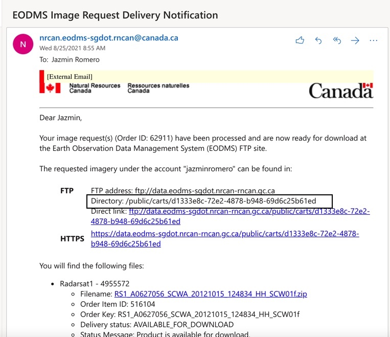

Tutorial on how to run SigLib/Query.py or standalone script query_imgs.py.
===========================================================================

To be able to run the SigLib on query mode, the first step consists of changing the config file (config.cfg) with query = 1 under Process section. After that simply type: 

``python SigLib.py config.cfg``

On the other hand, the standalone script can be run as follows:

``python query_imgs.py  config.cfg``

If the scripts successfully run, the following menu should appear on the screen:

``Available Query Methods:``

``1: tblmetadata: Query``

``2: tblmetadata: Download``

``3: CIS Archive (WIRL users only)``

``4: EODMS: Query``

``5: EODMS: Order``

``6: EODMS: Download``

``7: Copernicus: Query``

``8: Copernicus: Download``

``9: Execute Raw Sql Query``

``0: Exit``

``Please select the desired query method (0,1,2,3,4,5,6,7,8,9):``

Setup the config file to run the query mode
============================================
The first step to run the query mode is to update the config file (config.cfg) as follows. Under the section *MISC*, update the parameters *roi*, *roiprojSRID*, and *spatialrel* with the name of the ROI shapefile (as it is found in the database), the projection, and the spatial relation (either *ST_Intersects* or *ST_Overlaps*). 

In addition, under the section *Database*, the parameter *table* should contain the name of the local table to be queried (this only applies when querying local tables). Finally, an additional parameter should be added to the config file is *outDir* under the section *Directories*. This parameter should contain the directory where the images will be downloaded. Notice that such directory should exists on disk. 

Querying a ROI shapefile on a local table
==========================================
We clarify that the ROI shapefile and the table to be queried should already exists on the local database. For details about how to upload a ROI and how to create a local table on the local database please consult **Section X?**.

Let us suppose we would like to query a ROI shapefile called ArcticBay with roiprojSRID=4326 and ST_Intersects as spatialrel. The local table that we want to query is tblmetadata. After updating the config file as explained in the initial section of this tutorial, the config file should look as follows:

``[Database]``

…

``table = tblmetadata``

…

``[MISC]``

…

``roi = ArcticBay``

``roiprojSRID = 4326``

…

``spatialrel = ST_Intersects``

After that, we run ``python query_imgs.py  config.cfg`` or ``python SigLib.py  config.cfg``, and we select from the menu option ``1: tblmetadata: Query``. 

We expect the following output, if there were no errors when executing the query:

``ROI start date: 2010-05-01  end date: 2015-12-31``

``Query completed. Write query results to:``

``1: CSV file``

``2: Local table``

``3: Both``

``Enter your option (1,2,3):``

With this menu, the user can select either to output the results to a CSV file or to a local table. 

Suppose we choose option *1: CSV file*, the program will output a standard filename. The user can accept that name or type one of its own. Notice that only the filename with extension should be provided (no path). 

``Filename will be: ArcticBay_tblmetadata_24-08-2021_13-44.csv``

``Press [Enter] to accept this name or Introduce a new filename (add .csv extension):``

Suppose for example, we keep the provided name. Afterwards, the program will ask if the images should be downloaded:

``Results saved to /home/outDir/ArcticBay_tblmetadata_24-08-2021_13-44.csv``

``Download 2 images to output directory [Y/N]? N``

Notice that if choosing *Y* all the images in the query result will be downloaded to the output directory (outDir). 

Downloading images from a local table  
======================================
The user can either download the images directly after performing a query to a local table, or alternatively, he can filter the results in the CSV file or in the results table to narrow the images to download. After doing such filtering, the images could be download with the option ``2: tblmetadata: Download``.

Suppose for example, we filter the previous file ``/home/outDir/ArcticBay_tblmetadata_24-08-2021_13-44.csv``, and now we select option 2. After that, we introduce to the program the location of the csv file. 

``Enter CSV filename or tablename of images to download: /home/outDir/ArcticBay_tblmetadata_24-08-2021_13-44.csv``

After that, the script will output the list of download images to a txt file. The rest of the query execution could follow like this:

``Filename will be: ArcticBay_download_metadata_PATHS_24-08-2021_14-45.txt``
``Press [Enter] to accept this name or Introduce a new filename (add .txt extension):``

``List of downloaded images: /home/outDir/ArcticBay_download_metadata_PATHS_24-08-2021_14-45.txt``

In this example, ArcticBay_download_metadata_PATHS_24-08-2021_14-45.txt, will contain the list of the paths of the download images.

Querying EODMS
==============

To query EODMS (as well as Sentinel), we must place all the ROI shapefiles (5 files) on the *vectDir* directory. The config file must be modified as was explained at the beginning of this Section.

To query the EODMS database (https://www.eodms-sgdot.nrcan-rncan.gc.ca/index-en.html), we select option 4 from the Query menu. After that, a series of questions would be asked by the program:

``Enter collection to query or press enter for default "Radarsat1":``

``ROI start date 2010-05-01 end date 2015-12-31``

``Enter EODMS username: eodms_user``

``Enter EODMS password: ******``

``Querying EODMS...``

``2021-08-24 15:42:20 | eodmsapi.main | WARNING | Number of search results (150) equals query limit (150)``

``Fetching result metadata: 100%|██████████| 296/296 [01:03<00:00,  4.65item/s]``

``Query completed. Write query results to:`` 

``1: CSV file``

``2: Local table``

``3: Both``

``Enter your option (1,2,3):``

``Filename will be: ArcticBay_EODMS_24-08-2021_15-51.csv``

``Press [Enter] to accept this name or Introduce a new filename (add .csv extension):``

``Results saved to /home/outDir/ArcticBay_EODMS_24-08-2021_15-44.csv``

``Would you like to order the images? [Y/N] N``

The user could order directly all the images returned by EODMS or alternatively he could filter the results first and order them in a separate step. 

Order Images to EODMS
======================

Let us suppose we filtered the CSV file obtained in the previous example ``/home/outDir/ArcticBay_EODMS_24-08-2021_15-44.csv``. To order the images from EODMS, we select the option ``5: EODMS: Order``.  The program will ask the location and name of the file or alternatively table with the images to order.

``Enter CSV filename or tablename of images to order: /home/outDir/ArcticBay_EODMS_24-08-2021_15-51.csv``.

``Ordering 5 images:``
``Would you like to order 5 images? [Y/N]	Y``
``Enter collection to order or press enter for default "Radarsat1":`` 
``Enter EODMS username: eodms_user``
``Enter EODMS password: ******``

``2021-08-25 08:53:20 | eodmsapi.main | INFO | Submitting order for 5 items``
``Order [516096, 516097, 516093, 516094, 516095] submitted. Wait for confirmation email.``
``Images ordered to EODMS. Wait for confirmation email.``

Download EODMS
==============

Two emails are received from EODMS, the first one is a confirmation that the order was received, and the second one has the ftp location of the images. It should look something like the email below:

To download all the ordered images, we select option ``6: EODMS: Download``.  This option prompt us to enter the cart directory. This directory corresponds to the “Directory” information under FTP section.  If the cart is still available, all the files will be downloaded to the output directory.

``Enter cart directory: /public/carts/d1333e8c-72e2-4878-b948-69d6c25b61ed``

``Downloading...RS1_A0627056_SCWA_20121015_124834_HH_SCW01f.zip``
``All files downloaded for 181s``
``Downloading...RS1_A0627101_SCWA_20121005_124016_HH_SCW01f.zip``
``All files downloaded for 155s``
``Downloading...RS1_A0626939_SCWA_20121011_130504_HH_SCW01f.zip``
``All files downloaded for 169s``
``Downloading...RS1_A0627215_SCWA_20121009_122350_HH_SCW01f.zip``
``All files downloaded for 123s``
``Downloading...RS1_A0627116_SCWA_20121016_221354_HH_SCW01f.zip``
``All files downloaded for 39s``

``Filename will be: _eodms_PATHS_25-08-2021_09-27.txt``
``Press [Enter] to accept this name or Introduce a new filename (add .txt extension):``

``List of downloaded images: /home/outDir/_eodms_PATHS_25-08-2021_09-27.txt``
``The file /_eodms_PATHS_25-08-2021_09-27.txt contains the list of the filenames downloaded.``

Query to Copernicus
===================

Similar as with EODMS, we must place all the ROI shapefiles (5 files) on the *vectDir* location. The config file must be modified as was explained in Section 1.

After that we select ``7: Copernicus: Query``. Here is a sample of the execution:

``Enter satellite to query or press enter for default "Sentinel-2":`` 

``Enter product type or press enter for "None":``

``Enter sensor type ("SM", "IW", "EW", "WV") or press enter for None:``

``ROI start date 2010-05-01 end date 2015-12-31``

``Enter your Copernicus username: copernicus_user``

``Enter your Copernicus password: ******``

``Querying products: 100%|██████████| 371/371 [00:06<00:00, 42.13 products/s]``

``Query completed. Write query results to:``

``1: CSV file``

``2: Local table``

``3: Both``

``Enter your option (1,2,3): 1``

``Filename will be: ArcticBay_SENTINEL_25-08-2021_10-01.csv``

``Press [Enter] to accept this name or Introduce a new filename (add .csv extension):``

``File saved to /home/outDir/ArcticBay_SENTINEL_25-08-2021_10-01.csv``

``Would you like to download 371 images? [Y/N]	 N``

Download Copernicus
===================

To download images from Copernicus, we select option ``8: Copernicus: Download`` from the menu. 
Let us suppose we filtered the CSV file from the previous example. Below is the execution and interaction with the program for downloading images.

``Enter CSV filename or tablename of images to download: /home /outDir/ArcticBay_SENTINEL_25-08-2021_10-01.csv``

``Do you want to download 5 images [Y/N] Y``

``Enter your Copernicus username: copernicus_user``

``Enter your Copernicus password: ******``

``S2A_MSIL2A_20201013T175311_N0214_R141_T16XEG_20201017T092049 is offline - Retry later.``

``Try next file.``

``S2A_MSIL2A_20201012T182321_N0214_R127_T16XEG_20201012T224404 is offline - Retry later.``

``Try next file.``

``S2B_MSIL2A_20201011T180259_N0214_R041_T16XEG_20201011T201358 is offline - Retry later.``

``Try next file.``

``S2A_MSIL2A_20190302T182251_N0211_R127_T16XEG_20190302T225351 is offline - Retry later.``

``Try next file.``

``S2B_MSIL2A_20190226T175309_N0211_R141_T16XEG_20190226T214409 is offline - Retry later.``

``Try next file.``

``There were 5 offline images. Retry to download them later.``

For this example, all the images were offline and cannot be downloaded. However, since we attempted to download the images, some hours later they will be available to download. 

Notice that even if some of the images were online, we don’t need to remove those records from the CSV file to attempt to download the offline images again. Images that are already downloaded will not be downloaded again (unless they are deleted from the directory *outDir*).

Execute SQL query
=================

This option of the program simply executes blindly an SQL query. To execute an example select ``option 9: Execute Raw Sql Query`` from the menu. Below is an example of the execution:

``Enter file with SQL query: /home/outDir/rawsql_.sql``

``Filename will be: _SQL_25-08-2021_13-20.csv``

``Press [Enter] to accept this name or Introduce a new filename (add .csv extension):``

``Results saved to /home/outDir/_SQL_25-08-2021_13-20.csv``

