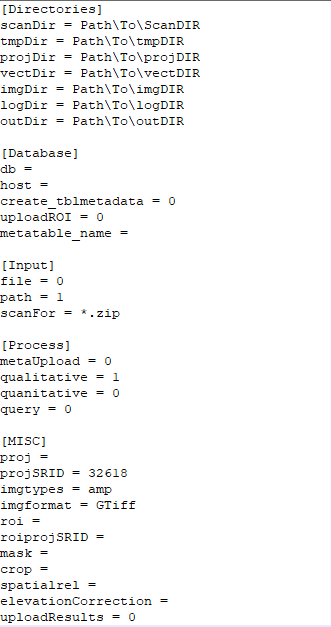
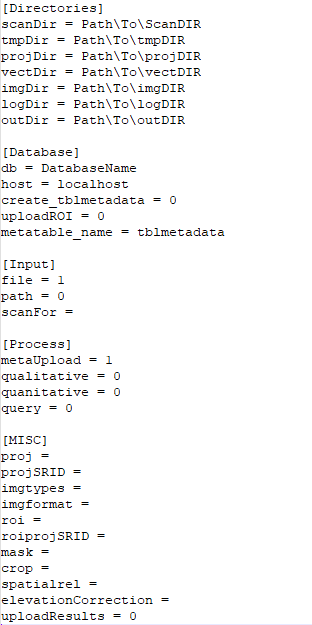

Using SigLib
============

Welcome to the tutorial sections of the Siglib documentation! This section 
will be used to give a brief overview of how to use the Metadata, 
Util, Database, and Image functions via Siglib and its config,
or in a custom way via qryDatabase. Examples will be given on how to do:
basic radarsat image processing via Siglib and config, extracting and uploading
metadata via Siglib, config, and the Linux parallel library, a customizable
Discovery mode via qryDatabase, and Scientific mode via Siglib and config.  

Basic Siglib Setup
------------------

Before Siglib and its dependencies can be used for the first time, some 
basic setup must first be completed. In the downloaded Siglib file, there 
should be five Python files, a config file, and an extras folder 
containing some odds and ends (including this very document you are reading!). 

Inside the main Siglib folder alongside the five main Python files and the config, 
a number of directory folders must be created and associated with the 
config file. Please see the config section of the documentation above for 
the required folders. These directories are used to keep the various input, 
temporary, and output files organized. Once created, the full path to each file 
must be added to the config file alongside the directory it is set to represent. 
The config file contains example path listings for example purposes.
 
Now, for Siglib.py to recognise and use the config file properly, your
Python IDE must be set up for running via the command line. The following
instructions on how to set this up will be given for the Spyder Python IDE
by Anaconda, the setup for other IDE's may vary. 

1. Go to Run -> Configuration per file... (Ctrl + f6) 

2. Under General Settings, check the box labeled 
	*Command Line Options:*

3. In the box to the right, put the full path to the config
	file, including the config file itself and its extension.

4. Press the OK button to save the setting and close the
	window
	
Example #1: Basic Radarsat2 Image Processing using Siglib
---------------------------------------------------------

Now that the basic setup steps are complete, we can being our first
example! In this example we will be doing a basic xml - to - Tiff 
image processing job for a couple of Radarsat2 image files, via Siglib.
Before any work beings in Python, the config file must be configured for this
type of job. (Add picture with desired settings!!!!). Place a few radarsat2 zip files 
in your testzips directory, then open your IDE configured for command line 
running, and run Siglib. 

What will happen is as follows: The zipfile will be extracted to the temp 
directory via Util.py. The metadata will then be extracted and saved to the output 
directory, via Metadata.py. An initial Tiff image will then be created via GDAL 
(soon to be snappy),  and saved to the output directory. The image will then be reprojected 
and the stats produced into a new Tiff file, the old one being deleted, all this via Image.py. 
The temp directory will then be cleaned and Siglib will move onto the next zipfile,
if more than one are being processed.

	A basic config file for this task

Example #2: Discover Radarsat metadata and upload to a geodatabase
------------------------------------------------------------------

This example will be the first introduction to Database.py and PGAdmin. 
In this example we will be uploading the metadata of radarsat scenes to a
geodatabase for later reference (and for use in later examples). This process
will be done using the parallel library on linux. See https://www.gnu.org/software/parallel
for documentation and downloads for the parallel library. **NOTE:** This example only
works on *linux* machines, how the results of this example can be replicated
on other machines will be explained afterwards.

This job will be done via the data2db process of Siglib, as seen in the
config under *Process*, so change that setting to 1, and any other setting under
*Process* to 0. Also, in order for parallel running to work properly, the input
must be **File** not **Path**, so that setting must be switched in the config
under *Input*. A review of the settings needed for this particular example can be 
seen in the image below.

	Config file settings for discovering and uploading metadata

To start the parallel job:

1. Open a terminal

2. cd into the directory containing all your radarsat images (They can be in multiple
	directories, just make sure they are below the one you cd into, or they will
	not be found)

3. Type in the terminal: 
	**find . -name '*.zip' -type f | parallel -j 16 --nice 15 --progress python /tank/SCRATCH/cfitzpatrick/SigLib.py /tank/SCRATCH/cfitzpatrick/config_linux.cfg** 

	Where -j is the number of cores to use, and --nice is how nice the process will be to 
	other processes (I.E. A lower --nice level gives this job a higher priority over
	other processes). The first directory is the location of your verison of Siglib.py,
	the second is the location of the associated config file. 

**NOTE:** ALWAYS test parallel on a small batch before doing a major run, to make
sure everything is running correctly. 

What happens once you hit *ENTER* is Parallel will step though your selected
directory looking for .zip files, once one is found, it will pass it to one of the
16 availible (or however many cores you set) openings of Siglib.py. Siglib will
unzip the file via Util.py, grab the metadata via Metadata.py, then connect to your
desired database, and unpload this retrieved metadata to the relational table
*tblmetadata* (which will have to be created by running createTblMetadata() in 
Database.py before parallelizing) via Database.py. This will repeat until parallel has 
fully stepped through your selected directory. 

Any Siglib process can be parallelized, as long as the correct config parameters
are set, and the above steps on starting a parallel job are followed.

The same results for this example can be achieved for non-linux machines by
putting all the zip files containing metadata for upload into your testzips directory,
and using the config settings as seen in the image below, similar to the first example.

Example #3: Discovery Mode via qryDatabase.py
---------------------------------------------

For this example, we are diverging away from the set rules of Siglib.py and
config files, and getting our hands dirty so to speak. Siglib.py and its associated
config file is a neat, organized way to do certain tasks in large batches. However,
Metadata.py, Util.py, Image.py, and Database.py contain an extrordinary number of 
customizable functions, some of which are not even covered by Siglib.py! Other times,
Siglib can just be too complex for small batch runs. This is why the function 
qryDatabase.py was created: to show off how to to use Siglibs' dependencies in 
custom ways! 

For this example, qryDatabase.py is configured to search through your relational
table tblmetadata (made in example #2) based on an uploaded ROI shapefile, and find 
images that overlap this ROI. The results can then be sent to anothet table, exported to
a csv, made into real images, or whatever you like! This is the beauty of customization.
	
To begin, open qryDatabase.py, Metadata.py, Util.py, and Database.py in your
desired IDE. Unlike in example #1, your IDE **should not** be configured for running
via command line! The config file is not used by this script, all the settings are set
in program. At the top of the script is a parameters selction with the various directories,
and a few other settings needed. An ROI (Region of Interest) is a shapefile containing 
polygons of land areas of interest, you can look at **Sample_DiscoveryROI_lcc.shp** in
the extras folder as an example before making one of your own. 
	
	Discovery Mode in its simplest form only takes five lines, these are:

1. db = Database.Database('')
	where '' is your desired database

2. db.updateROI(roi, roiProj, homedir, True) #loads (overwrites) ROI file into dbase

3. copylist, instimg = db.qrySelectFromAvailable(roi, selectFrom, spatialrel, roiProj) 
	#Spatial query to find overlapping images

4. db.instimg2db(roi, spatialrel, instimg, mode='create')  
	#this uploads the instimg to a relational table in the database
 
5. db.removeHandler()

These five lines connect you to your database, upload the ROI to the database, 
runs a query to find what images overlap the roi, uploads the results to another table,
and cancels the logging system. 
	
This is a very basic example, but feel free to modify qryDatabase to suit your
specific needs! More information on all the availible functions Siglib and its 
dependencies have to offer can be seen further on in this documentation in the 
*Siglib API* section of this documentation.

Example #4: Scientific Mode!
----------------------------

In this final example, we will dive into the depths of Siglibs' Scientific Mode!
Scientific Mode (as described in an earlier section of this documentation) is a way of 
taking normal radarsat images and converting them to a new image type (sigma0, 
noise level, or incidense angle) as well as cutting them up and masking them into small 
pieces via a scientific ROI of many small polygons of study areas. 
	
In Siglib.py, there is a spcific function for this mode, which can be configured
via the config file. 

(Work on the Siglib version of this functionality, and finish documentation once complete)

Conclusion
----------

This is the conclusion to the *Using Siglib* section of this documentation. For 
additional help in using Siglib.py and its dependencies, please refer to the next section
of this documentation, *Siglib API*. This section gives and overview, the parameters, 
and the outputs, of each function in the main five scripts.

	
	

	
	
	
	
	
